# 📚 LearnMate.ai

An intelligent learning companion powered by LlamaIndex and Ollama, designed to revolutionize the way students interact with their study materials.


## 🎯 Features

- 📝 **Smart Document Processing**
  - Upload and process study materials (PDFs, notes, research papers)
  - Automatic summarization and key point extraction
  - Intelligent document indexing using LlamaIndex

- 🤖 **AI-Powered Learning**
  - Context-aware question answering
  - Intelligent web search for incomplete information
  - RAG (Retrieval Augmented Generation) system

- 📊 **Assessment & Analytics**
  - Generate custom quizzes and flashcards
  - Track performance and identify weak areas
  - Downloadable progress reports

## 🏗️ Architecture

```mermaid
flowchart LR
    classDef primary fill:#e1f5fe,stroke:#01579b
    classDef secondary fill:#f3e5f5,stroke:#4a148c
    classDef accent fill:#e8f5e9,stroke:#1b5e20

    Input["🗂️ Document Input<br/>(PDFs/Notes)"]:::primary
    Process["⚙️ LlamaIndex<br/>Processing"]:::primary
    DB[("🗄️ Vector Store")]:::secondary
    Agent["🤖 AI Agents<br/>(RAG + Search)"]:::secondary
    Features["📊 Learning Features"]:::accent
    
    subgraph Models["🧠 LLM Models"]
        direction TB
        Ollama["🦙 Ollama"]
        OpenAI["🔄 OpenAI"]
    end
    
    subgraph Output["📚 Learning Tools"]
        direction TB
        Summary["📝 Summaries"]
        QA["❓ Q&A System"]
        Quiz["📝 Assessments"]
        Analytics["📊 Analytics"]
    end

    Input --> Process
    Process --> DB
    DB --> Agent
    Agent --> Models
    Models --> Output
    Output --> Features

    style Models fill:#fff4e5,stroke:#ff6f00
    style Output fill:#e3f2fd,stroke:#0d47a1
```



## 🚀 Getting Started

### Prerequisites

```bash
Python 3.8+
Ollama
OpenAI API Key (optional)
```

### Installation

1. Clone the repository
```bash
git clone https://github.com/yourusername/learnmate-ai.git
cd learnmate-ai
```

2. Create a virtual environment
```bash
python -m venv venv
source venv/bin/activate  # On Windows: venv\Scripts\activate
```

3. Install dependencies
```bash
pip install -r requirements.txt
```

4. Set up environment variables
```bash
cp .env.example .env
# Edit .env with your configuration
```

5. Run the application
```bash
python main.py
```

## 📖 Usage

1. **Document Upload**
   - Upload your study materials through the web interface
   - Supported formats: PDF, TXT, DOCX

2. **Learning Interface**
   - Ask questions about your materials
   - Generate summaries and key points
   - Create custom assessments

3. **Analytics Dashboard**
   - View performance metrics
   - Track progress over time
   - Download detailed reports

## 🛠️ Technology Stack

- **Backend Framework**: Python FastAPI
- **Document Processing**: LlamaIndex
- **LLM Integration**: Ollama, OpenAI
- **Vector Store**: ChromaDB
- **Frontend**: React + Vite
- **Analytics**: Plotly/Chart.js

## 🤝 Contributing

Contributions are welcome! Please feel free to submit a Pull Request.

1. Fork the repository
2. Create your feature branch (`git checkout -b feature/AmazingFeature`)
3. Commit your changes (`git commit -m 'Add some AmazingFeature'`)
4. Push to the branch (`git push origin feature/AmazingFeature`)
5. Open a Pull Request

## 📝 License

This project is licensed under the MIT License - see the [LICENSE](LICENSE) file for details.

## 📧 Contact

Saumya Gupta - [@yourusername](https://twitter.com/saumya_812) - saumyagupta2025@gmail.com

Project Link: [https://github.com/saumyagupta2025/learnmate-ai](https://github.com/saumyagupta2025/LearnMate.ai/tree/main)
